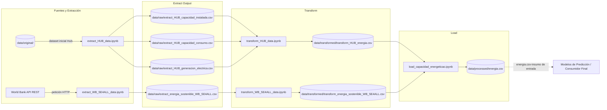

# Predicción de la demanda eléctrica mediante fuentes de energía renovables en los 20 países con mayor consumo de América Latina
Este pipeline de ETL extrae datos históricos de generación, capacidad instalada y consumo eléctrico (vía HUB de energía) junto con los indicadores de acceso, sostenibilidad e intensidad energética (vía API REST de World Bank SE4ALL), los unifica para los 20 países con mayor consumo eléctrico de América Latina en una ventana temporal común (2000-2021), realiza el proceso de limpieza, imputación estructural, escalado y pivoteo en formato ancho; finalmente, en la fase de carga, genera un dataset optimizado para posteriormente ser usado para entrenar un modelo predictivo de demanda eléctrica regional.

**Curso:** ETL — Maestría en Inteligencia Artificial y Ciencia de Datos, Universidad Autónoma de Occidente
**Periodo:** 2026-2
**Docente:** Fernando Barraza Alvarado
## Integrantes

| Nombre | Código | Usuario de GitHub |
|---|---|---|
| Andres Coral | 22615813 | @Anfeco20 |
| Carlos Daza | 22615364 | @carlosdazar |
| Walter Arredondo| 22615208 | @omnicontrol-tech |

## Tabla de contenido

1. [Descripción del problema](#1-descripción-del-problema)
2. [Fuentes de datos](#2-fuentes-de-datos)
3. [Arquitectura del pipeline](#3-arquitectura-del-pipeline)
4. [Estructura del repositorio](#4-estructura-del-repositorio)
5. [Requisitos](#5-requisitos)
6. [Instalación y configuración](#6-instalación-y-configuración)
7. [Ejecución](#7-ejecución)
8. [Detalle de las etapas ETL](#8-detalle-de-las-etapas-etl)
9. [Modelo y diccionario de datos](#9-modelo-y-diccionario-de-datos)
10. [Calidad de datos y validaciones](#10-calidad-de-datos-y-validaciones)
11. [Resultados](#11-resultados)
12. [Limitaciones y trabajo futuro](#12-limitaciones-y-trabajo-futuro)
13. [Referencias](#13-referencias)

## 1. Descripción del problema
Cuando se habla de demanda eléctrica de un país, se hace referencia a la cantidad de electricidad que cierta cantidad de consumidores requieren para abastecer sus necesidades (industrias, oficinas, comercio, hogares). El incremento socioeconómico y poblacional, así como los cambios en los patrones de consumo, han sido factores determinantes para el aumento en la demanda eléctrica en los países de América Latina. Esta situación ha sido un desafío para los sistemas eléctricos de la región, por lo cual se ha buscado la incorporación de nuevas fuentes de energías renovables que permitan satisfacer las necesidades futuras de electricidad.

Este proyecto surge con la necesidad de consolidar y preparar un flujo de datos limpio y estructurado que integre diferentes métricas de consumo, generación y sostenibilidad eléctrica de los 20 países con mayor consumo energético de la región, con el fin de generar diferentes mecanismos que permitan predecir la demanda eléctrica y analizar en qué medida es posible satisfacerla mediante el uso de energías renovables.

**Objetivo:** Generar un dataset final “maestro” unificado, estandarizado en formato ancho, acotado en una rejilla temporal al periodo de 2000-2021, con datos limpios de generación (PTJ), capacidad instalada (PTJ), consumo por sector (PTJ), así como los indicadores de acceso (PTJ), sostenibilidad (USD) e intensidad eléctrica (PTJ). El cual puede ser utilizado como insumo inicial para entrenar modelos de predicción de la demanda eléctrica regional. También puede ser aplicado en el análisis comportamental de la generación y consumo eléctrico por país en una rejilla temporal de 2000 a 2021.

## 2. Fuentes de datos

| Fuente | Tipo (CSV, API, BD, web) | Origen / URL | Tamaño aprox. | Frecuencia de actualización | Licencia |
|---|---|---|---|---|---|
| **Hub de Energía** (Generación, Capacidad y Consumo) | Archivo Excel | Hub de Energía : https://hubenergia.org/index.php/es/indicators/capacidad-generacion-y-consumo-de-electricidad | ~1,320 filas × 24 columnas (3 hojas) | Anual | Uso publico |
| **World Bank SE4ALL API** (Indicadores de acceso, sostenibilidad e intensidad energética) | API REST (JSON) |World Bank Data API: https : //data360api.worldbank.org/data360/data?DATABASE_ID=WB_SE4ALL| ~4,400 registros (8 indicadores × 20 países × 22 años) | Anual |CC-BY 4.0|

### Cobertura Geográfica y Temporal
* **Periodo de estudio:** 2000 – 2021 (rejilla temporal uniforme de 22 años).
* **Alcance geográfico:** Top 20 países con mayor consumo energético de América Latina:

País | País |
|---|---|
| 1. Brasil | 11. Uruguay|
| 2. México | 12. Guatemala |
| 3. Argentina | 13. Costa Rica |
| 4. Chile | 14. Panama |
| 5. Colombia | 15. Bolivia |
| 6. Perú | 16. Honduras |
| 7. Venezuela | 17. El Salvador |
| 8. Ecuador | 18. Nicaragua|
| 9. República Dominicana | 19. Cuba |
| 10. Paraguay | 20. Haití |

## 3. Arquitectura del pipeline


El pipeline esta orquestado mediante un notebook principal (pipeline.ipynb), ejecuta de forma modular la siguiente secuencia de flujo ETL:
1. Extract: Para la fuente Hub se ejecuta el notebook de extracción "extract_HUB_data.ipynb" obteniendo el archivo original  xlsx de la carpeta data/original y para la API del banco mundial se ejecuta el notebook "extract_WB_SE4ALL_data.ipynb". se generan los siguientes archivos que se depositan en la carpeta data/raw:
* extract_HUB_capacidad_instalada.csv
* extract_HUB_capacidad_consumo.csv
* extract_HUB_generacion_electrica.csv
* extract_energia_sostenible_WB_SE4ALL.csv

2. Transform: lee los datos que se obtuvieron de la fase de extracción de data/raw. aplica limpieza, estandarización de variables, homologación de unidades e imputación de datos nulos o faltantes. los resulados generados que se depositan en la carpeta data/transformed son:
* transform_HUB_energia.csv.csv
* transform_energia_sostenible_WB_SE4ALL.csv
  
3. Load: Toma los conjuntos de datos transformados de data/transformed/, realiza la consolidación final (merge) en formato ancho (wide) para la rejilla temporal 2000–2021 y exporta el Dataset Maestro unificado en data/processed/ --- parte de walter

**Tecnologías:** Python 3.10+, pandas, NumPy, requests, openpyxl, matplotlib, ydata-profiling, subprocess, pathlib, Google Colab / Google Drive, Git/GitHub, SQLAlchemy, PostgreSQL

## 4. Estructura del repositorio

```
├── data               <- Conjuntos de datos
│
│   ├── original       <- Conjuntos de datos originales HUB de energía.
│   │  ├── hub.xlsx
│   ├── transformed    <- Conjuntos de datos finales trasformados, listos para load.
│   │  ├── transform_HUB_energia.csv.csv
│   │  ├── transform_energia_sostenible_WB_SE4ALL.csv
│   └── raw            <- Datos originales de la extracción, sin modificar.
│   │  ├── extract_HUB_capacidad_instalada.csv
│   │  ├── extract_HUB_capacidad_consumo.csv
│   │  ├── extract_HUB_generacion_electrica.csv
│   │  ├── extract_energia_sostenible_WB_SE4ALL.csv
│   └── load           <- Dataset "Maestro" final, listo para análisis o modelado.
│   │  ├── energia.scv
│   └── model          <- Modelo Predicción de la demanda eléctrica 20 países con mayor consumo de América Latina.
├
├── extract            <- Código de extracción de datos.
│   │  ├── extract_HUB_data.ipynb
│   │  ├── extract_WB_SE4ALL_data.ipynb
├
├── transform          <- Código de limpieza y transformación.
│   │  ├── transform_HUB_data.ipynb
│   │  ├── transform_WB_SE4ALL_data.ipynb
├
├── load               <- Código de carga al destino.
│   │  ├── load_capacidad_energetica.ipynb
├
├── model               <- Código  Modelo Predicción de la demanda eléctrica 20 países con mayor consumo de América Latina.
│   │  ├── load_demanda_atendida_renovable.ipynb
├
├── pipeline.py        <- Orquesta la ejecución completa (extract → transform → load).
│
├── requirements.txt   <- Dependencias del proyecto.
│
├── .gitignore         <- Archivos que git debe ignorar.
│
└── README.md          <- Este archivo.
```
## 5. Requisitos
### Requisitos del sistema
**Entorno Principal:** Google Colab ( Python 3.10+ configuración de la nube) almacenamiento en Google Drive.

**Ejecución Local (Opcional):** Python 3.10 o superior y Júpiter Notebook/ JupyterLab.

### Dependencias requeridas
Las principales librerías utilizadas en los notebooks son:
- "Pandas" ( manipulación de datos y estructuras Dataset)
- "Numpy"  ( operaciones numéricas y vectoriales)
- "Request" ( peticiones HTTP a la API del Banco Mundial)
- "openpyxl" ( lectura y escritura de archivos Excel de Hub de energía)
- "matplotlib" (generación de gráficos)
- "ydata-profiling" (generación automática de reportes HTML para EDA  de datos)
- walter
## 6. Instalación y configuración
### Instrucciones de ejecución
#### Opción 1 (Recomendada) Ejecutar en Google Colab
1. Subir la carpeta del proyecto a la unidad de **Google Drive** en la ruta:
   "/My Drive/Colab Notebooks/Master/1.ETL/entregable3/"
2. Asegurase de tener el dataset inicial HUB, lo puede descargar en https://hubenergia.org/index.php/es/indicators/capacidad-generacion-y-consumo-de-electricidad, este se debe guardar en la ruta "data/original/"
3. Abrir y ejecutar el notebook orquestador **"pipeline.ip`ynb"**
4. El notebook montará automáticamente Google Drive mediante "drive.mount('/content/drive')" y ejecutará de forma secuencial los notebooks de las carpetas `extract/`, `transform/` y `load/`.
#### Opción 2 Ejecución Local
1. clonar el repositorio (https://github.com/carlosdazar/etl-demanda-electrica.git)
2. Correr el local
- Dependencias listadas en `requirements.txt`
```bash
# 1. Clonar el repositorio
git clone https://github.com/[usuario]/[repositorio].git
cd [repositorio]

# 2. Crear y activar el entorno virtual
python -m venv .venv
source .venv/bin/activate        # Windows: .venv\Scripts\activate

# 3. Instalar dependencias
pip install -r requirements.txt
```
### Variables de entorno
Este proyecto no requiere llaves API ni credenciales privadas ya que es de acceso público.
Para mantener la flexibilidad de ejecución entre entono local y Google Colab, se utiliza la variable global de ruta base `BASE_DIR` en cada notebook:
 Variable | Descripción | Ejemplo |
|---|---|---|
| `BASE_DIR` | Ruta raíz del proyecto donde se leen y escriben las capas de datos (`data/`)| `/content/drive/MyDrive/Colab Notebooks/Master/1.ETL/entregable3` |
| `API_WB_SE4ALL_URL` | Endpoint base público de la API del Banco Mundial| https : //data360api.worldbank.org/data360/data?DATABASE_ID=WB_SE4ALL |
### Obtención de los datos
los datos crudos usados en el pipeline provienen de dos fuentes distintas y se gestionan de la siguiente manera:
1.***HUB de energía***
-***método de obtención***: Requiere descarga previa en https://hubenergia.org/index.php/es/indicators/capacidad-generacion-y-consumo-de-electricidad. Se debe guardar manualmente en la carpeta `data/original/`
-***proceso de extracción***: Al ejecutar el notebook `extract/extract_HUB_data.ipynb` se lee el archivo inicial, separa y filtra las tres categorías principales, guarda los archivos en `data/raw/`:


