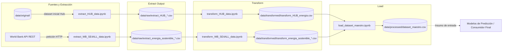

# Predicción de la demanda eléctrica mediante fuentes de energía renovables en los 20 países con mayor consumo de América Latina
Este pipeline de ETL extrae datos históricos de generación, capacidad instalada y consumo eléctrico (vía HUB de energía) junto con los indicadores de acceso, sostenibilidad e intensidad energética (vía API REST de World Bank SE4ALL), los unifica para los 20 países con mayor consumo eléctrico de América Latina en una ventana temporal común (2000-2021), realiza el proceso de limpieza, imputación estructural, escalado y pivoteo en formato ancho; finalmente, en la fase de carga, genera un dataset optimizado para posteriormente ser usado para entrenar un modelo predictivo de demanda eléctrica regional.

**Curso:** ETL — Maestría en Inteligencia Artificial y Ciencia de Datos, Universidad Autónoma de Occidente
**Periodo:** 2026-2
**Docente:** Fernando Barraza Alvarado
## Integrantes

| Nombre | Código | Usuario de GitHub |
|---|---|---|
| Andres Coral | 22615813 | @Anfeco20 |
| Carlos Daza | 22615364 | @carlosdazar |
| Walter Arredondo| 22615208 | @omnicontrol-tech |

## Tabla de contenido

1. [Descripción del problema](#1-descripción-del-problema)
2. [Fuentes de datos](#2-fuentes-de-datos)
3. [Arquitectura del pipeline](#3-arquitectura-del-pipeline)
4. [Estructura del repositorio](#4-estructura-del-repositorio)
5. [Requisitos](#5-requisitos)
6. [Instalación y configuración](#6-instalación-y-configuración)
7. [Ejecución](#7-ejecución)
8. [Detalle de las etapas ETL](#8-detalle-de-las-etapas-etl)
9. [Modelo y diccionario de datos](#9-modelo-y-diccionario-de-datos)
10. [Calidad de datos y validaciones](#10-calidad-de-datos-y-validaciones)
11. [Resultados](#11-resultados)
12. [Limitaciones y trabajo futuro](#12-limitaciones-y-trabajo-futuro)
13. [Referencias](#13-referencias)

## 1. Descripción del problema
Cuando se habla de demanda eléctrica de un país, se hace referencia a la cantidad de electricidad que cierta cantidad de consumidores requieren para abastecer sus necesidades (industrias, oficinas, comercio, hogares). El incremento socioeconómico y poblacional, así como los cambios en los patrones de consumo, han sido factores determinantes para el aumento en la demanda eléctrica en los países de América Latina. Esta situación ha sido un desafío para los sistemas eléctricos de la región, por lo cual se ha buscado la incorporación de nuevas fuentes de energías renovables que permitan satisfacer las necesidades futuras de electricidad.

Este proyecto surge con la necesidad de consolidar y preparar un flujo de datos limpio y estructurado que integre diferentes métricas de consumo, generación y sostenibilidad eléctrica de los 20 países con mayor consumo energético de la región, con el fin de generar diferentes mecanismos que permitan predecir la demanda eléctrica y analizar en qué medida es posible satisfacerla mediante el uso de energías renovables.

**Objetivo:** Generar un dataset final “maestro” unificado, estandarizado en formato ancho, acotado en una rejilla temporal al periodo de 2000-2021, con datos limpios de generación (PTJ), capacidad instalada (PTJ), consumo por sector (PTJ), así como los indicadores de acceso (PTJ), sostenibilidad (USD) e intensidad eléctrica (PTJ). El cual puede ser utilizado como insumo inicial para entrenar modelos de predicción de la demanda eléctrica regional. También puede ser aplicado en el análisis comportamental de la generación y consumo eléctrico por país en una rejilla temporal de 2000 a 2021.

## 2. Fuentes de datos

| Fuente | Tipo (CSV, API, BD, web) | Origen / URL | Tamaño aprox. | Frecuencia de actualización | Licencia |
|---|---|---|---|---|---|
| **Hub de Energía** (Generación, Capacidad y Consumo) | Archivo Excel | Hub de Energía : https://hubenergia.org/index.php/es/indicators/capacidad-generacion-y-consumo-de-electricidad | ~1,320 filas × 24 columnas (3 hojas) | Anual | Uso publico |
| **World Bank SE4ALL API** (Indicadores de acceso, sostenibilidad e intensidad energética) | API REST (JSON) |World Bank Data API: https : //data360api.worldbank.org/data360/data?DATABASE_ID=WB_SE4ALL| ~4,400 registros (8 indicadores × 20 países × 22 años) | Anual |CC-BY 4.0|

### Cobertura Geográfica y Temporal
* **Periodo de estudio:** 2000 – 2021 (rejilla temporal uniforme de 22 años).
* **Alcance geográfico:** Top 20 países con mayor consumo energético de América Latina:

País | País |
|---|---|
| 1. Brasil | 11. Uruguay|
| 2. México | 12. Guatemala |
| 3. Argentina | 13. Costa Rica |
| 4. Chile | 14. Panama |
| 5. Colombia | 15. Bolivia |
| 6. Perú | 16. Honduras |
| 7. Venezuela | 17. El Salvador |
| 8. Ecuador | 18. Nicaragua|
| 9. República Dominicana | 19. Cuba |
| 10. Paraguay | 20. Haití |

## 3. Arquitectura del pipeline

