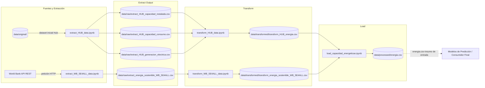

# Predicción de la demanda eléctrica mediante fuentes de energía renovables en los 20 países con mayor consumo de América Latina
Este pipeline de ETL extrae datos históricos de generación, capacidad instalada y consumo eléctrico (vía HUB de energía) junto con los indicadores de acceso, sostenibilidad e intensidad energética (vía API REST de World Bank SE4ALL), los unifica para los 20 países con mayor consumo eléctrico de América Latina en una ventana temporal común (2000-2021), realiza el proceso de limpieza, imputación estructural, escalado y pivoteo en formato ancho; finalmente, en la fase de carga, genera un dataset optimizado para posteriormente ser usado para entrenar un modelo predictivo de demanda eléctrica regional.

**Curso:** ETL — Maestría en Inteligencia Artificial y Ciencia de Datos, Universidad Autónoma de Occidente
**Periodo:** 2026-2
**Docente:** Fernando Barraza Alvarado
## Integrantes

| Nombre | Código | Usuario de GitHub |
|---|---|---|
| Andres Coral | 22615813 | @Anfeco20 |
| Carlos Daza | 22615364 | @carlosdazar |
| Walter Arredondo| 22615208 | @omnicontrol-tech |

## Tabla de contenido

1. [Descripción del problema](#1-descripción-del-problema)
2. [Fuentes de datos](#2-fuentes-de-datos)
3. [Arquitectura del pipeline](#3-arquitectura-del-pipeline)
4. [Estructura del repositorio](#4-estructura-del-repositorio)
5. [Requisitos](#5-requisitos)
6. [Instalación y configuración](#6-instalación-y-configuración)
7. [Ejecución](#7-ejecución)
8. [Detalle de las etapas ETL](#8-detalle-de-las-etapas-etl)
9. [Modelo y diccionario de datos](#9-modelo-y-diccionario-de-datos)
10. [Calidad de datos y validaciones](#10-calidad-de-datos-y-validaciones)
11. [Resultados](#11-resultados)
12. [Limitaciones y trabajo futuro](#12-limitaciones-y-trabajo-futuro)
13. [Referencias](#13-referencias)

## 1. Descripción del problema
Cuando se habla de demanda eléctrica de un país, se hace referencia a la cantidad de electricidad que cierta cantidad de consumidores requieren para abastecer sus necesidades (industrias, oficinas, comercio, hogares). El incremento socioeconómico y poblacional, así como los cambios en los patrones de consumo, han sido factores determinantes para el aumento en la demanda eléctrica en los países de América Latina. Esta situación ha sido un desafío para los sistemas eléctricos de la región, por lo cual se ha buscado la incorporación de nuevas fuentes de energías renovables que permitan satisfacer las necesidades futuras de electricidad.

Este proyecto surge con la necesidad de consolidar y preparar un flujo de datos limpio y estructurado que integre diferentes métricas de consumo, generación y sostenibilidad eléctrica de los 20 países con mayor consumo energético de la región, con el fin de generar diferentes mecanismos que permitan predecir la demanda eléctrica y analizar en qué medida es posible satisfacerla mediante el uso de energías renovables.

**Objetivo:** Generar un dataset final “maestro” unificado, estandarizado en formato ancho, acotado en una rejilla temporal al periodo de 2000-2021, con datos limpios de generación (PJ), capacidad instalada (PJ), consumo por sector (PJ), así como los indicadores de acceso (PJ), sostenibilidad (USD) e intensidad eléctrica (PJ). El cual puede ser utilizado como insumo inicial para entrenar modelos de predicción de la demanda eléctrica regional. También puede ser aplicado en el análisis comportamental de la generación y consumo eléctrico por país en una rejilla temporal de 2000 a 2021.

## 2. Fuentes de datos

| Fuente | Tipo (CSV, API, BD, web) | Origen / URL | Tamaño aprox. | Frecuencia de actualización | Licencia |
|---|---|---|---|---|---|
| **Hub de Energía** (Generación, Capacidad y Consumo) | Archivo Excel | Hub de Energía : https://hubenergia.org/index.php/es/indicators/capacidad-generacion-y-consumo-de-electricidad | ~1,320 filas × 24 columnas (3 hojas) | Anual | Uso publico |
| **World Bank SE4ALL API** (Indicadores de acceso, sostenibilidad e intensidad energética) | API REST (JSON) |World Bank Data API: https : //data360api.worldbank.org/data360/data?DATABASE_ID=WB_SE4ALL| ~4,400 registros (8 indicadores × 20 países × 22 años) | Anual |CC-BY 4.0|

### Cobertura Geográfica y Temporal
* **Periodo de estudio:** 2000 – 2021 (rejilla temporal uniforme de 22 años).
* **Alcance geográfico:** Top 20 países con mayor consumo energético de América Latina:

País | País |
|---|---|
| 1. Brasil | 11. Uruguay|
| 2. México | 12. Guatemala |
| 3. Argentina | 13. Costa Rica |
| 4. Chile | 14. Panama |
| 5. Colombia | 15. Bolivia |
| 6. Perú | 16. Honduras |
| 7. Venezuela | 17. El Salvador |
| 8. Ecuador | 18. Nicaragua|
| 9. República Dominicana | 19. Cuba |
| 10. Paraguay | 20. Haití |

## 3. Arquitectura del pipeline


El pipeline esta orquestado mediante un notebook principal (pipeline.ipynb), ejecuta de forma modular la siguiente secuencia de flujo ETL:
1. Extract: Para la fuente Hub se ejecuta el notebook de extracción "extract_HUB_data.ipynb" obteniendo el archivo original  xlsx de la carpeta data/original y para la API del banco mundial se ejecuta el notebook "extract_WB_SE4ALL_data.ipynb". se generan los siguientes archivos que se depositan en la carpeta data/raw:
* extract_HUB_capacidad_instalada.csv
* extract_HUB_capacidad_consumo.csv
* extract_HUB_generacion_electrica.csv
* extract_energia_sostenible_WB_SE4ALL.csv

2. Transform: lee los datos que se obtuvieron de la fase de extracción de data/raw. aplica limpieza, estandarización de variables, homologación de unidades e imputación de datos nulos o faltantes. los resulados generados que se depositan en la carpeta data/transformed son:
* transform_HUB_energia.csv.csv
* transform_energia_sostenible_WB_SE4ALL.csv
  
3. Load: Toma los conjuntos de datos transformados de data/transformed/, realiza la consolidación final (merge) en formato ancho (wide) para la rejilla temporal 2000–2021 y exporta el Dataset Maestro unificado en data/processed/ --- parte de walter

**Tecnologías:** Python 3.10+, pandas, NumPy, requests, openpyxl, matplotlib, ydata-profiling, subprocess, pathlib, Google Colab / Google Drive, Git/GitHub, SQLAlchemy, PostgreSQL

## 4. Estructura del repositorio

```
├── data               <- Conjuntos de datos
│
│   ├── original       <- Conjuntos de datos originales HUB de energía.
│   │  ├── hub.xlsx
│   ├── transformed    <- Conjuntos de datos finales trasformados, listos para load.
│   │  ├── transform_HUB_energia.csv
│   │  ├── transform_energia_sostenible_WB_SE4ALL.csv
│   └── raw            <- Datos originales de la extracción, sin modificar.
│   │  ├── extract_HUB_capacidad_instalada.csv
│   │  ├── extract_HUB_capacidad_consumo.csv
│   │  ├── extract_HUB_generacion_electrica.csv
│   │  ├── extract_energia_sostenible_WB_SE4ALL.csv
│   └── load           <- Dataset "Maestro" final, listo para análisis o modelado.
│   │  ├── energia.scv
│   └── model          <- Modelo Predicción de la demanda eléctrica 20 países con mayor consumo de América Latina.
├   ├  ├── modelo_extratrees_energia.pkl
├
├── extract            <- Código de extracción de datos.
│   │  ├── extract_HUB_data.ipynb
│   │  ├── extract_WB_SE4ALL_data.ipynb
├
├── transform          <- Código de limpieza y transformación.
│   │  ├── transform_HUB_data.ipynb
│   │  ├── transform_WB_SE4ALL_data.ipynb
├
├── load               <- Código de carga al destino.
│   │  ├── load_capacidad_energetica.ipynb
├
├── model               <- Código  Modelo Predicción de la demanda eléctrica 20 países con mayor consumo de América Latina.
│   │  ├── model_demanda_atendida_renovable.ipynb
├
├── pipeline.py        <- Orquesta la ejecución completa (extract → transform → load).
│
├── requirements.txt   <- Dependencias del proyecto.
│
├── .gitignore         <- Archivos que git debe ignorar.
│
└── README.md          <- Este archivo.
```
## 5. Requisitos
### Requisitos del sistema
**Entorno Principal:** Google Colab ( Python 3.10+ configuración de la nube) almacenamiento en Google Drive.

**Ejecución Local (Opcional):** Python 3.10 o superior y Júpiter Notebook/ JupyterLab.

### Dependencias requeridas
Las principales librerías utilizadas en los notebooks son:
- "Pandas" ( manipulación de datos y estructuras Dataset)
- "Numpy"  ( operaciones numéricas y vectoriales)
- "Request" ( peticiones HTTP a la API del Banco Mundial)
- "openpyxl" ( lectura y escritura de archivos Excel de Hub de energía)
- "matplotlib" (generación de gráficos)
- "ydata-profiling" (generación automática de reportes HTML para EDA  de datos)
- walter
## 6. Instalación y configuración
### Instrucciones de ejecución
#### Opción 1 (Recomendada) Ejecutar en Google Colab
1. Subir la carpeta del proyecto a la unidad de **Google Drive** en la ruta:
   "/My Drive/Colab Notebooks/Master/1.ETL/entregable3/"
2. Asegurase de tener el dataset inicial HUB, lo puede descargar en https://hubenergia.org/index.php/es/indicators/capacidad-generacion-y-consumo-de-electricidad, este se debe guardar en la ruta "data/original/"
3. Abrir y ejecutar el notebook orquestador **"pipeline.ip`ynb"**
4. El notebook montará automáticamente Google Drive mediante "drive.mount('/content/drive')" y ejecutará de forma secuencial los notebooks de las carpetas `extract/`, `transform/` y `load/`.
#### Opción 2 Ejecución Local
1. clonar el repositorio (https://github.com/carlosdazar/etl-demanda-electrica.git)
2. Correr el local
- Dependencias listadas en `requirements.txt`
```bash
# 1. Clonar el repositorio
git clone https://github.com/[usuario]/[repositorio].git
cd [repositorio]

# 2. Crear y activar el entorno virtual
python -m venv .venv
source .venv/bin/activate        # Windows: .venv\Scripts\activate

# 3. Instalar dependencias
pip install -r requirements.txt
```
### Variables de entorno
Este proyecto no requiere llaves API ni credenciales privadas ya que es de acceso público.
Para mantener la flexibilidad de ejecución entre entono local y Google Colab, se utiliza la variable global de ruta base `BASE_DIR` en cada notebook:
 Variable | Descripción | Ejemplo |
|---|---|---|
| `BASE_DIR` | Ruta raíz del proyecto donde se leen y escriben las capas de datos (`data/`)| `/content/drive/MyDrive/Colab Notebooks/Master/1.ETL/entregable3` |
| `API_WB_SE4ALL_URL` | Endpoint base público de la API del Banco Mundial| https : //data360api.worldbank.org/data360/data?DATABASE_ID=WB_SE4ALL |
### Obtención de los datos
los datos crudos usados en el pipeline provienen de dos fuentes distintas y se gestionan de la siguiente manera:

1.**HUB de energía**

**método de obtención**: Requiere descarga previa en https://hubenergia.org/index.php/es/indicators/capacidad-generacion-y-consumo-de-electricidad. Se debe guardar manualmente en la carpeta `data/original/`

2. **World Bank (SE4ALL API REST)**

**método de obtención**: Extracción desde  la API RES JSON https : //data360api.worldbank.org/data360/data?DATABASE_ID=WB_SE4ALL

## 7. Ejecución

### Pipeline completo

el pipeline se encuentra orquestado mediante el notebook `pipeline.ipynb`.

**En Google Colab/ Jupyter** Abrir `pipeline.ipynb`. y seleccione la opción **"Ejecutar todas"**.
```bash
  jupyter nbconvert --to notebook --execute pipeline.ipynb
```
### Ejecución por Etapas

Si se requiere ejecutar las etapas por separado se debe seguir el siguiente orden secuencial:

```bash
#1. Extracción 
# Abrir y ejecutar
#extract/extract_HUB_data.ipynb
#extract/extract_WB_SE4ALL_data.ipynb
#2. Transformación
# Abrir y ejecutar
#transform/transform_HUB_data.ipynb
#transform/ transform_energia_sostenible_WB_SE4ALL.csv
#3. Carga
# Abrir y ejecutar
#load/energia.scv
```
### Salida esperada

Al finalizar la ejecución ya sea con el pipeline o por etapas se obtienen los siguientes resultados:

En `data/raw`

* `extract_HUB_capacidad_instalada.csv`
* `extract_HUB_capacidad_consumo.csv`
* `extract_HUB_generacion_electrica.csv`
* `extract_energia_sostenible_WB_SE4ALL.csv`

En `data/transformed`

* `transform_HUB_energia.csv`
* `transform_energia_sostenible_WB_SE4ALL.csv`

En `data/load`
* `energia.csv` ( Dataset final consolidado en formato ancho para 20 Países de América Latina entre los años 2000 a 2021)
  
En `extract`
* Reportes de perfilado y/o EDA en formato HTML (`ydata-profiling`)

El tiempo estimado de ejecución es entre 2 y 6 Minutos en total ( depende de la latencia de respuesta de la API del banco Mundial)ç

## 8. Detalle de las etapas ETL

### 8.1 Extract

- **Qué hace:** Extrae los datos generación , capacidad y consumo por sector de los 20 países de mayor consumo de América Latina a partir del dataset inicial HUB de energía y realiza consultas HTTP  a la API REST del banco mundial SE4ALL para obtener los Indicadores de acceso, sostenibilidad e intensidad energética
  
- **Notebooks:**
  
    - `extract/extract_HUB_data.ipynb`
     - `extract_WB_SE4ALL_data.ipynb`
   
- **Salidas (`data/raw/`):**
    - `extract_HUB_capacidad_instalada.csv`
    - `extract_HUB_capacidad_consumo.csv`
    - `extract_HUB_generacion_electrica.csv`
    - `extract_energia_sostenible_WB_SE4ALL.csv`  

### 8.2 Transform

- **Qué hace:** Limpia. estandariza y normaliza los dataset obtenidos de la fase de extracción, aplica homologación de unidades energéticas a Petajulios ($PJ$) y estructura en formato ancho (*wide*).
  
- **Notebooks:**

  - `transform_WB_SE4ALL_data.ipynb`
  - `transform_HUB_data.ipynb`
 
- **Salidas (`data/transformed/`):**
  -  `transform_HUB_energia.csv`
  - `transform_energia_sostenible_WB_SE4ALL.csv`
    
| # | Transformación | Justificación |
|---|---|---|
| 1 | Conversión y homologación de unidades | Conversión de métricas energéticas heterogéneas a una unidad estándar común (Petajulios, PJ). |
| 2 | Imputación de nulos en `columna _valor` HUB | Imputación estructural con el uso del valor real 0 para preservar la relación temporal de las fuentes. |
| 3 | Filtrado de ventana temporal (2000–2021) | Homologación del rango de años continuo con información disponible en ambas fuentes de datos. |
| 4 | Eliminación de columnas con valores nulos `COMMENT_OBS, DECIMALS, COMMENT_TS, DATA_SOURCE y UNIT_TYPE`  | no contienen información observable que pueda utilizarse directamente en la integración o modelamiento. |
| 5 | Estandarización y normalización  | los valores pueden quedar expresados en una magnitud incorrecta y afectar tanto la integración, la interpretación y el modelamiento. |
| 6 | Pivoteo a formato ancho (wide) | Reestructuración de la tabla para colocar indicadores como columnas individuales por país y año.. |
| 7 | Unión de fuentes (Hub de Energía + WB SE4ALL) por llave `[pais, anio]` | garantiza la correcta alineación alineando exactamente cada métrica de consumo, capacidad e indicador sostenible al país y año exacto al que corresponden. |

### 8.3 Load

- **Qué hace:** Consolida los datos procesados en la etapa transform (`data/transformed/`),realiza la consolidación final (merge) en formato ancho (wide) para la rejilla temporal 2000–2021 y exporta el Dataset Maestro unificado en `data/processed/` listo para ser consumido por modelos de predicción o para el análisis comportamental de la generación y consumo eléctrico por país en una rejilla temporal de 2000 a 2021.

- **Notebooks:**
  
    - `load_capacidad_energetica.ipynb`

- **Salidas (`data/load/`):**
  
     - `energia.csv`

    
## 9. Modelo y diccionario de datos

El producto final del pipeline es una estructura de datos tabular plana en formato ancho, la granularidad del dataset esta definida por la combinación de **País** y **Año** (`[pais, anio]`).

### Estructura general de las 48 variables 

| Categoría | N° Cols | Descripción y Variables Clave |
|---|---|---|
| **Identificadores** | 2 | `pais` (*string*), `anio` (*integer*) |
| **Acceso e Intensidad (WB)** | 3 | `acceso_electricidad_pt`, `acceso_combustibles_tecnologias_limpias_pt`, `intensidad_energetica_mj_pib` |
| **Capacidad Renovable p/cápita (WB)** | 8 | `capacidad_renovable_total_w_persona`, `capacidad_renovable_hidroelectrica_w_persona`, `capacidad_renovable_solar_w_persona`, `capacidad_renovable_eolica_w_persona`, etc. |
| **Consumo y Proporción Renovable (WB)** | 5 | `consumo_renovable_electricidad_pj`, `consumo_final_total_energia_pj`, `proporcion_energias_renovables_total_pt`, etc. |
| **Flujos Financieros Renovables (WB)** | 8 | `flujos_financieros_renovables_total_usd`, `flujos_financieros_solar_usd`, `flujos_financieros_eolica_usd`, etc. |
| **Capacidad Instalada por Fuente (Hub)** | 8 | `capacidad_hidro`, `capacidad_solar`, `capacidad_eolica`, `capacidad_termica no renovable`, etc. |
| **Consumo por Sector (Hub)** | 6 | `consumo_residencial`, `consumo_transporte`, `consumo_industrial`, `consumo_comercial, servicios, publico`, `consumo_agro, pesca y mineria`, `consumo_construccion y otros` |
| **Generación por Fuente (Hub)** | 8 | `generacion_hidro`, `generacion_eolica`, `generacion_solar`, `generacion_termica no renovable`, `generacion_nuclear`, etc. |

---

### Diccionario de Datos

| Columna | Tipo | Fuente | Descripción | Ejemplo |
|---|---|---|---|---|
| `pais` | `string` | General | Nombre estandarizado del país (América Latina) | `Argentina` |
| `anio` | `integer` | General | Año correspondiente a la observación (2000–2021) | `2000` |
| `acceso_electricidad_pt` | `float` | WB SE4ALL | Cobertura del servicio eléctrico (% de la población) | `95.7` |
| `capacidad_renovable_total_w_persona` | `float` | WB SE4ALL | Capacidad renovable instalada por habitante (W/persona) | `235000000.0` |
| `consumo_final_total_energia_pj` | `float` | WB SE4ALL | Consumo final total de energía en Petajulios ($PJ$) | `1655.8` |
| `intensidad_energetica_mj_pib` | `float` | WB SE4ALL | Intensidad energética de la economía (MJ por PIB PPA) | `3.69` |
| `consumo_residencial` | `float` | Hub Energía | Consumo final de energía en el sector residencial | `1.09` |
| `consumo_transporte` | `float` | Hub Energía | Consumo final de energía en el sector transporte | `0.125` |
| `generacion_hidro` | `float` | Hub Energía | Generación eléctrica bruta de fuente hídrica | `103.54` |
| `generacion_termica no renovable` | `float` | Hub Energía | Generación eléctrica a partir de combustibles fósiles | `165.90` |
| `...` | — | — | *38 columnas adicionales siguiendo la misma estructura de nomenclatura.* | — |

## 10. Calidad de datos y validaciones

| Verificación | Antes Datos Crudos (Extract) | Después Dataset Consolidado (Processed) |
|---|---|---|
| Número de registros | > 500 Registros globales no filtrados | 440 - 20 países de América Latina - 22 años (2000–2021) |
| Registros duplicados | Duplicados potenciales por consultas repetidas | [0] verificación  sobre la llave `[pais, anio]`|
| Nulos en variables Hub de Energía| [1297 columna_valor] | [0] |
| Nulos en variables WB SE4ALL| [13939 columnas COMMENT_OBS, DECIMALS, COMMENT_TS, DATA_SOURCE y UNIT_TYPE] | [0]|
| Homologación temporal | rangos diferentes entre base de datos (1990-2022) (1970-2021)  | rejilla temporal común (2000-2021)  |

Como parte de la fase de validación exploratoria, se implementó `ydata-profiling` para generar reportes automatizados en HTML.

## 11. Resultados
walter
### Modelo de Predicción

El dataset consolidado (`dataset_maestro.csv`) permitió alimentar y evaluar distintos modelos de Machine Learning para proyectar la demanda Energética de los 20 paises de mayor consumo en América latina.

#### concepto de demanda Energetica

La demanda Energetica de un Pais representa la cantidad total de energía que los usuarios (hogares, industrias y comercios) requieren en un momento específico para operar sus equipos y satisfacer sus necesidades. La capacidad de cubrir dicho consumo mediante energía renovable depende de la disponibilidad instantánea o anual de la generación de las fuentes las cuales son:


*   Fuente Eólica
*   Fuente Solar
*   Fuente hidroeléctrica
*   Fuente geotérmica
*   Fuente biomasa

Un país no puede consumir más energía renovable de la que genera, ni tampoco puede "atender" masa energía renovable que la que los usuarios demandan.

Se define la variable Demanda Atendida mediante Fuentes Renovables

*   Demanda_Atendida_Renovable= min(Demanda_Electrtica_Total,  Generación_Renovable_Total)

#### Entrenamiento de modelos

Con el fin de entrenar y comparar decenas de modelos de aprendizaje automático se utiliza la libreria de python Lazypredict

* Ya que se tienen secuencias de datos u observaciones de una variable tomados en momentos específicos, ordenados de manera cronológica y separados por intervalos (Años) se puede aplicar Ingenieria de caracteristicas para series Temporales con el fin de enseñarle al modleo el historial del pasado y las tendencias de los datos.ç

### Resultados

Despues de aplicar Featuring Engineering a series temporales se obtuvo los resultados coefciente de variazión o R2. Se determino que los 3 mejores modelos son:

* ExtraTreesRegressor
* GradientBoostingRegressor
* BaggingRegressor

Se decidio utlizar ExtraTreesRegressor, este es un modelo de aprendizaje automático para predecir valores numéricos (regresión) mediante un conjunto de árboles de decisión. A diferencia de Random Forest, elige los puntos de corte de las ramas de forma completamente al azar en lugar de buscar el óptimo,reduciendo drásticamente la varianza del modelo.

las metricas que se obtuvieron fueron:

| Métrica | Prueba (Test) |
|---|---|
|MAE (Error Absoluto Medio) | 0.32555375 | 
| MSE (Error Cuadrático Medio) | 0.32771844 |
| RMSE (Raíz del MSE)	 | 0.57246697 |
| R² (Coef. Determinación) | 0.93576204 |


*   Mae = indica que el modelo se equivoco un 32% en sus prediciones.
*   MSE =  indica que existe poco margen de error con los datos no vistos, la desviación entre lo que predijo el modleo y los datos reales de prueba es reducida.
*   RMSE = indica el error promedio dando mas peso a los fallos grandes atipicos, en este caso la desviación es de solo 0.57 unidades
*  R²  =  indica que el modelo predice el 93.6% de los datos de manera correcta

De esta forma se puede concluir que el modelo ExtraTreesRegressor presenta un desempeño sobresaliente con el dataset que se obtuvo en la fase Load, permitiendo predecir la demanda atendida renovable en los 20 países con mayor consumo de América Latina utilizando la rejila temporal de 2000 a 2021.

El modelo queda guardado en `data/model` como `modelo_extratrees_energia.pkl`

## 12. Limitaciones y trabajo futuro
## 13. Referencias
